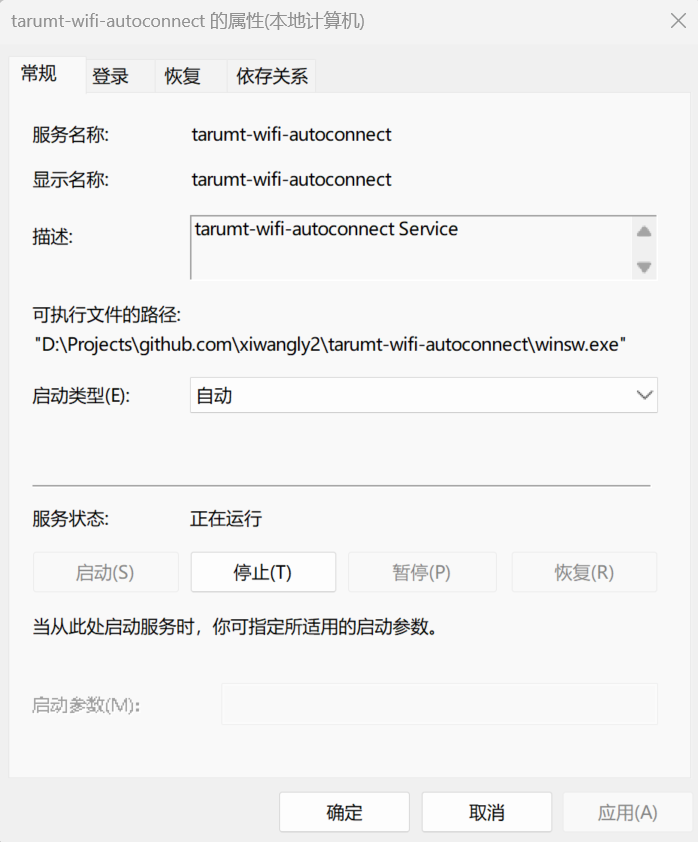

# tarumt-wifi-autoconnect

自动连接 TARUMT 的 校园网

本程序永远都不会提供任何违反法律法规以及任何破坏网络安全的功能，这个程序只是一个解放双手的工具，解决每次都要手动登录校园网的繁琐步骤，不会对网络安全造成任何威胁

目前最新的是 Go 语言版本，使用前请复制`config_example.json`到可执行文件目录下的`config.json`，然后根据提示填进去就可以了

搓这个程序最初是为了 最小硬件开销 以及 最大硬件兼容性，前人的方案要么是 curl 命令要么是 OpenWrt 插件，或者 Python 脚本，硬件开销都太大了点，所以我就搓了这个 Go 语言的程序，Go 最大的优势就是编译后的程序体积小，而且不依赖于系统库，所以可以在很多系统上运行

## 快速开始

1. 去 [Releases](https://github.com/wochaoop/tarumt-wifi-autoconnect/releases) 下载对应系统架构的压缩包
2. 解压这个文件
3. 切换到与配置文件相同的目录
4. 创建并编辑`config.json`配置文件（也可以通过其他方式上传配置文件）

```json
{
  "username": "your_student_id",
  "password": "your_password",

  "loginURL": "https://connect.tarc.edu.my/login",
  "StatusURL": "https://connect.tarc.edu.my/status",
  "RefererURL": "https://connect.tarc.edu.my/",
  "OriginURL": "https://connect.tarc.edu.my",
  "WiFiIP": "2.2.2.2",
  "UserAgent": "Mozilla/5.0 (Windows NT 10.0; Win64; x64) AppleWebKit/537.36 (KHTML, like Gecko) Chrome/133.0.0.0 Safari/537.36",
  "AttemptDelay": 600,
  "OnlyOnce": false
}
```

5. 直接运行可执行文件，可以指定参数

参数示例：

```bash
# 指定配置文件的路径
./tarumt-wifi-autoconnect -config ./config.json
```

### 开机自启

若要开机自启，有以下几种方法可供选择

#### 使用 Systemd 的 init 系统

对于使用了 systemd 的操作系统，推荐使用此方法

新建`/usr/lib/systemd/system/tarumt-wifi-autoconnect.service`配置文件

```bash
[Unit]
Description=tarumt-wifi-autoconnect service
After=network.target syslog.target
Wants=network.target

[Service]
Type=simple
ExecStart=/root/tarumt-wifi-autoconnect -config /root/config.json
WorkingDirectory=/root/

[Install]
WantedBy=multi-user.target
```

启用这个配置文件：

`systemctl enable tarumt-wifi-autoconnect`

使用以上命令，程序将在系统启动时自动启动。如果需要重启应用，可以使用以下命令：

`systemctl restart tarumt-wifi-autoconnect`

如果要停止应用，可以使用以下命令：

`systemctl stop tarumt-wifi-autoconnect`

要查看应用的日志，可以使用以下命令：

`systemctl status tarumt-wifi-autoconnect`

以上路径请根据实际情况修改

#### 使用 OpenRC 的 init 系统

对于使用 service 命令的操作系统发行版上，推荐使用这种方法

新建`/etc/init.d/tarumt-wifi-autoconnect`脚本文件

编辑这个脚本文件：

```bash
#!/bin/sh /etc/rc.common

START=90
STOP=10

SERVICE_NAME="tarumt-wifi-autoconnect"
SERVICE_PATH="/root/$SERVICE_NAME"
CONFIG_PATH="/root/config.json"

start() {
    echo "Starting $SERVICE_NAME service..."
    nohup $SERVICE_PATH -config=$CONFIG_PATH >/dev/null 2>&1 &
}

stop() {
    echo "Stopping $SERVICE_NAME service..."
    killall -q "$SERVICE_PATH"
}

restart() {
    $0 stop
    sleep 1
    $0 start
}

status() {
    pgrep -f "$SERVICE_PATH -config $CONFIG_PATH" > /dev/null
    if [ $? -eq 0 ]; then
        echo "$SERVICE_NAME service is running."
    else
        echo "$SERVICE_NAME service is not running."
    fi
}

reload() {
    echo "Reloading $SERVICE_NAME service..."
    $0 stop
    $0 start
}
```

授予执行权限：

```bash
chmod +x /etc/init.d/tarumt-wifi-autoconnect
```

启用服务：

```bash
service tarumt-wifi-autoconnect start
```

开机自启这个服务：
```bash
service tarumt-wifi-autoconnect enable
```

管理服务

```bash
service tarumt-wifi-autoconnect stop    # 停止服务
service tarumt-wifi-autoconnect restart # 重启服务
```

这样，你的服务就会使用service命令进行管理，可以在系统启动时自动运行，也可以手动启动、停止和重启

请确保脚本中的路径和命令是正确的，以便服务能够正常启动和运行

#### 使用 launchctl 工具添加启动项

对于 macOS 系统，推荐使用这种方法

新建`/Library/LaunchDaemons/tarumt-wifi-autoconnect.plist`配置文件

写入以下内容：（/your/path 应该替换为你实际存放的位置）

```xml
<?xml version="1.0" encoding="UTF-8"?>
<!DOCTYPE plist PUBLIC "-//Apple//DTD PLIST 1.0//EN" "http://www.apple.com/DTDs/PropertyList-1.0.dtd">
<plist version="1.0">
<dict>
    <key>Label</key>
    <string>tarumt-wifi-autoconnect</string>
    <key>ProgramArguments</key>
    <array>
        <string>/your/path/tarumt-wifi-autoconnect</string>
        <string>-config</string>
        <string>/your/path/config.json</string>
    </array>
    <key>RunAtLoad</key>
    <true/>
    <key>KeepAlive</key>
    <true/>
</dict>
</plist>
```

检查plist语法是否正确
```zsh
plutil /Library/LaunchDaemons/tarumt-wifi-autoconnect.plist
```

修改文件权限
```zsh
chmod 644 /Library/LaunchDaemons/tarumt-wifi-autoconnect.plist
```

添加自启动项
```zsh
launchctl load /Library/LaunchDaemons/tarumt-wifi-autoconnect.plist
```

启动自启动项
```zsh
launchctl start tarumt-wifi-autoconnect.plist
```

删除自启动项：
```zsh
launchctl unload /Library/LaunchDaemons/tarumt-wifi-autoconnect.plist
```

#### 使用`/etc/rc.local`文件

对于极致精简以及自定义了内核的 Linux/Unix 操作系统，则推荐下面的方式

有时候可以在诸如 OpenWrt、Pandavan 等的路由操作系统的 GUI 界面找到这个配置文件的编辑框

在中间插入`nohup /root/tarumt-wifi-autoconnect -config=/root/config.json >/dev/null 2>&1 &`命令

在文件中的示例：

```bash
#!/bin/sh -e
#
# rc.local
#
# This script is executed at the end of each multiuser runlevel.
# Make sure that the script will "exit 0" on success or any other
# value on error.
#
# In order to enable or disable this script just change the execution
# bits.
#
# By default this script does nothing.

nohup /root/tarumt-wifi-autoconnect -config=/root/config.json >/dev/null 2>&1 &

exit 0
```

#### 使用 nohup 命令

对于不支持 init 系统的 Linux/Unix 操作系统，推荐使用此方法

```bash
nohup /root/tarumt-wifi-autoconnect -config=/root/config.json >/dev/null 2>&1 &
```

这样，程序将在后台运行，即使退出终端也不会停止，但是重启系统后需要重新运行这个命令

#### 使用 winsw

对于 Windows 系统，推荐使用此方法

首先下载`winsw`：

- 访问`winsw`的 GitHub 页面：[winsw](https://github.com/winsw/winsw/releases/latest)
- 下载对应架构的最新版本的`winsw`
- 解压缩下载的`winsw`可执行文件
- 重命名`winsw.exe`并移动到本程序的相同目录中

然后编写`winsw.xml`文件，可以根据需要自行修改

```xml
<service>
    <id>tarumt-wifi-autoconnect</id>
    <name>tarumt-wifi-autoconnect</name>
    <description>tarumt-wifi-autoconnect Service</description>
    <executable>tarumt-wifi-autoconnect.exe</executable>
    <arguments>-config ./config.json</arguments>
    <interactive>false</interactive>
    <startmode>Automatic</startmode>
    <log mode="none"/>
</service>
```

安装服务：

- 打开命令提示符或PowerShell，并使用管理员权限运行。
- 运行以下命令安装服务：

```bat
.\winsw.exe install winsw.xml
```

到这里就已经完成了安装服务，下一次重启就能开机自启了

启动服务：

- 运行以下命令立即启动服务：

```bat
.\winsw.exe start winsw.xml
```

如果一切正常，在`Windows 服务`能看到这个服务：


#### 使用 Docker

如果操作系统安装了 docker ，则可以尝试这个方式

```bash
docker run -d --restart=always \
--pull=always \
--name=tarumt-wifi-autoconnect \
-v ${PWD}/config.json:/app/config.json \
ghcr.io/wochaoop/tarumt-wifi-autoconnect:latest
```

指定`--restart`以实现开机自启

## 支持的系统和架构

目前支持了如下系统、平台和架构

`aix-ppc64`
`android-arm64`
`darwin-amd64`
`darwin-arm64`
`dragonfly-amd64`
`freebsd-386`
`freebsd-amd64`
`freebsd-arm`
`freebsd-arm64`
`freebsd-riscv64`
`illumos-amd64`
`ios-amd64`
`ios-arm64`
`js-wasm`
`linux-386`
`linux-amd64`
`linux-arm`
`linux-arm64`
`linux-loong64`
`linux-mips`
`linux-mips64`
`linux-mips64le`
`linux-mipsle`
`linux-ppc64`
`linux-ppc64le`
`linux-riscv64`
`linux-s390x`
`netbsd-386`
`netbsd-amd64`
`netbsd-arm`
`netbsd-arm64`
`openbsd-386`
`openbsd-amd64`
`openbsd-arm`
`openbsd-arm64`
`openbsd-ppc64`
`plan9-386`
`plan9-amd64`
`plan9-arm`
`solaris-amd64`
`wasip1-wasm`
`windows-386`
`windows-amd64`
`windows-amd64-v3`
`windows-arm64`
`windows-armv7`


如果您的系统和架构不在上面的列表中，您可以尝试自行编译

愿意折腾的话，可以自行尝试动态链接库的方式编译，这样可以减小体积

[Releases](https://github.com/wochaoop/tarumt-wifi-autoconnect/releases) 中的文件是静态链接的，体积较大，不过通用性较好

